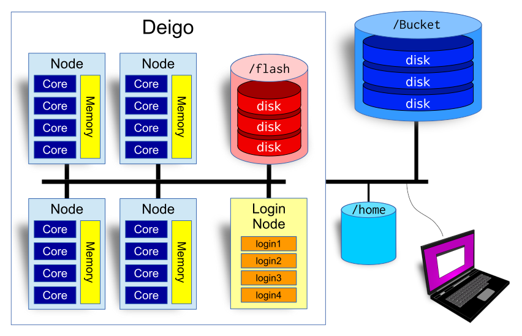

# Getting started

## Introduction {#high-performance-computing-at-oist}

Hi!

The *Scientific Computing and Data Analysis* section (SCDA) provides
several HPC systems and other computing resources for you here at OIST.
We provide compute clusters; high performance and secure storage;
software; and various services.

-   [Quick Start](#quick)
    -   [documentation, help and Open Hours](#documentation)
    -   [Apply for Access](#access)
-   [Our Resources](#resources)
    -   [What is a cluster?](#background)
    -   [compute clusters](#clusters)
    -   [storage](#storage)
-   [Using the Clusters](#Using_clusters)
    -   [Log in](#login)
    -   [Software Modules](#modules)
    -   [Submitting Jobs](#jobs)
        -   [Interactive Jobs](#interactive)
        -   [Batch Jobs](#batch)
        -   [Manage your jobs](#jobmanage)

## Quick Start and General Information {#quick}

You do not need to apply for access to storage as a remote folder.

-   All members of a research unit have access to the unit storage by
    default.

-   You can access the storage through remote folders (Samba), or
    through ssh. See our page on [copying
    data](https://groups.oist.jp/scs/copy-and-move-data) for details.
    For SSH access you need to apply for the cluster [though this
    page](https://groups.oist.jp/scs/request-access) (you don\'t have a
    home directory until you do).

-   If you are a student you may need to ask your Unit leader to add you
    to the unit. The unit leaders control this themselves, with no
    involvement from IT.

The rest of this Start Here document will be all about getting started
with the computing and storage resources at OIST. Read on!

### Documentation and Help {#documentation}

**Our documentation** is all [on our Documentation
page](https://groups.oist.jp/scs/documentation). This guide gives you
only a brief summary, so please go to the documentation page for much
more information.

**We have daily [Open Hours](https://groups.oist.jp/scs/open-hours).**
You can ask us about anything related to the OIST clusters, to
high-performance computing (HPC), or to computing and programming in
general. It is in room B648, every day between 15:30 and 17:30. It is
also online, using Zoom: <https://oist.zoom.us/j/593265965>

To contact us for help or questions you can also email us at
[ask-scda@oist.jp](https://groups.oist.jp/it-help%40oist.jp). Anything
related to HPC at OIST will go directly to us, and we\'ll try our best
to help you out.

**[HighSci](https://highsci.oist.jp/monitor/index.html) is your personal
portal page** to everything related to HPC. Here you can see how busy
the clusters are, what systems you have access to, how much storage you
are suing and much more.

### Get Access {#access}

To get access to the clusters, you need to apply. We have two kinds of
computing resources: *open resources* that everybody at OIST can get
immediate access to; and *restricted resources* where you need a reason
for access. Most users here at OIST don\'t need anything beyond the open
resources.

You apply for resources [through this
page](https://groups.oist.jp/scs/request-access).

Fill in [this
form](https://forms.office.com/Pages/ResponsePage.aspx?id=jfvA2Fa7u0SfSsWOdGVlLgU5CaM3VBNEpOLl8JDJ5o9UOUZGSDJYNlJCUENRQkVTMEk4REpFUFlCNC4u)
for open resources. You will typically get access within a day, but when
we are very busy it may take a little longer. In the comments, please
tell us what you plan to do - this is only so we get a sense of what
you\'re interested in.

For restricted resources you fill in [this
form](https://forms.office.com/Pages/ResponsePage.aspx?id=jfvA2Fa7u0SfSsWOdGVlLgU5CaM3VBNEpOLl8JDJ5o9UNDIyM1lUVjZOMVBNRVZWM1lQQUw3NEVHRC4u).
You need to select the specific resourse you need and tell us why you
need it. We will ask you to join our [Open
Hours](https://groups.oist.jp/scs/open-hours) where we can talk about it
with you, and tell you about any specific things to keep in mind when
using the resource.

## Our Resources {#resources}

### Background info: Clusters {#background}

Here a bit of background information on clusters and schedulers. If you
are already familiar with this, feel free to skip to the next section.

-   A cluster is a large, powerful computer system made up of many
    individual computers (called \"nodes\"), connected together in a
    high speed network.

-   Each node is a computer with it\'s own CPU, memory, local storage
    and a network interface.

-   There is also some form of fast storage systems (called \"flash\"
    and \"bucket\" here) connected to the network.

-   The cluster is controlled by software called a *scheduler.* The
    scheduler makes the nodes all work together. It allocates resources
    such as CPU cores and memory to applications (called \"jobs\" in
    HPC-speak) that users run, and it decides which job will run and
    when. Our scheduler software is called \"Slurm\".

-   In addition, there are a few machines called \"login nodes\" that
    all users log into. You use the cluster from the login nodes: this
    is where you run jobs, you can visualize your results, and manage
    your data.

You don\'t run programs on the cluster directly. You ask the scheduler
for the resources you need --- the number of CPU cores, the amount of
memory and the running time --- and tell it what to run. This is called
running a \"job\". We will discuss the details further down.\

This is roughly what happens when you want to run something on a
cluster.

1.  You log in to the cluster. This is usually done in a terminal, using
    a program called \"ssh\" (**s**ecure **sh**ell). Check the \"[log
    in](#login)\" section below, or you can get all the details [on this
    page](https://groups.oist.jp/scs/connect-clusters).

2.  You run a command to tell Slurm that you want to run a job. You tell
    it how many cores you want, how much memory you need and how many
    hours (or days) you need to finish. And you tell it how to run the
    program you want to use. This is a \"job\".\
    \
    Slurm puts your job in a queue with all other jobs that users have
    submitted. The order is mostly decided by age, so older jobs run
    first, but the amount of resources you ask for and how much you\'ve
    been using the cluster also matters. Check the section on
    \"[submitting jobs](#jobs)\" or see our page on how to use Slurm and
    submitting jobs [available
    here](https://groups.oist.jp/scs/use-slurm).

3.  When it\'s your turn, and resources are free for your job, Slurm
    will assign cores and memory to the job on one or more nodes, then
    start your application there. While the job is running, Slurm
    monitors the job to see that it\'s still running, makes sure it
    doesn\'t use too much memory and so on.

4.  Once your application is done, Slurm will stop the job, make sure
    any output is saved, optionally email you, then assign the newly
    freed resources to another job waiting in line.\

### Our Clusters {#clusters}

We have two production clusters at OIST:

[Deigo](https://groups.oist.jp/scs/deigo) is our main system. It is used
for general computing, for large-scale programs and for tasks that need
a lot of memory.

[Saion](https://groups.oist.jp/scs/saion-system) is a cluster with
specialized nodes for things such as GPU-accelerated computing. It is
often used for tasks such as deep learning and image analysis.

### Storage {#storage}

You have three kinds of storage available on each cluster. They are used
in different ways and for different things. Our storage system overview
is available [on this
page](https://groups.oist.jp/scs/research-storage).

Bucket** is our main
research storage. It has a large storage capacity and is backed up
offsite on a weekly basis. Use this to store all your research data,
your code and anything else you need to keep. Your unit has a directory
on bucket where you store all unit-related data.

It is available as /bucket/YourunitU on all systems. You can read and
write to it from the login nodes, from the \"datacp\" partition, and
mounted as a remote folder on your desktop. It is read-only on the
compute nodes (writing from them would slow it down too much).

home** is your personal
storage space. It is small (50GB) and slow. Use this storage for
personal files and documents, for source code, plots and similar. Do not
use this to store any research data and do not run jobs from here - the
system will slow your program down.

Your directory is in /home/X/your-username where \"your-username\" is
your OIST user name, and \"X\" is the first letter. If your name is
jan-moren, your directory would be at /home/j/jan-moren.

Flash** is the
temporary storage system for Deigo, and **work** is the temporary
storage for Saion. They are available as \"/flash\" and \"/work\",
respectively.

They are both very fast, but have a fixed and limited space of 10TB per
unit. They are available both read and write from the compute nodes. Use
these as temporary storage for your applications while they are running.
Be sure to clean up any data afterwards! The size is very limited and
they are not backed up.

You can access the Deigo storage from Saion and vice versa: Saions Work
is available as \"/saion_work\" on Deigo nodes; and Deigos Flash is
available as \"/flash\" on Saion nodes.

#### Using the storage

-   Store all permanent data on Bucket.

-   When you run a job, read input data directly from bucket, and store
    any temporary data on /flash or /work.

-   At the end of your job, copy results that you need to keep back to
    /bucket, then *clean up* the data you stored on /flash or /work. If
    you don\'t, they will fill up and your unit members can\'t run jobs
    on the systems any longer.

As /bucket is not writeable directly from the compute nodes, you need to
use \"scp\" if you want to copy results back from inside your job
script:

    scp /flash/MyunitU/my_results.dat deigo:/bucket/MyunitU/

This will copy \"my_results.dat\" to bucket from flash. For more
information and examples, see the [Deigo
page](https://groups.oist.jp/scs/deigo).

## Using the Clusters {#Using_clusters}

### Log in {#login}

You log in to the login nodes from a terminal with \"ssh\". For Windows
we recommend [MobaXTerm](https://mobaxterm.mobatek.net/). On Linux or
Mac you only need to open a terminal. Log in to Deigo with:

    $ ssh -X oist-username@deigo.oist.jp

Note: \"[\$\" above signifies that this is a command you type on the
command line. You don\'t type the \"\$]{.math .inline}\" itself.
\"oist-username\" is the same username you use to log in to TIDA. \"-X\"
tells ssh to allow the use of graphical applications across the network.

This will log you in to one of the login nodes on the Deigo cluster.

For more on accessing the cluster, please see our page on [connecting to
the clusters](https://groups.oist.jp/scs/connect-clusters).

If you have not used the Linux command line --- called \"bash\" ---
before, you can take a look at our [command line
introduction](https://groups.oist.jp/scs/intro-bash) page. If you\'re
feeling adventurous, we also have [more advanced
information](https://groups.oist.jp/scs/advanced-bash).

### Software Modules {#modules}

We have a collection of software packages installed on the clusters.
They range from general languages and tools such as Python, Julia or
Matlab, to scientific applications for very specific fields.

The software is installed as *modules.* With modules we can have
multiple different versions of software and libraries installed at the
same time. Our page on using modules is [\"use the Module
system\"](https://groups.oist.jp/scs/use-module-system).

Deigo and Saion have different versions of the module system, but they
work much the same. You have a command called \"module\" that lets you
list, search and load software. Deigo also has a short-form command
called \"ml\". See the page on modules above.

See the list of available (\"av\" is short for \"available\") modules:

    $ module av

Load a module:

    $ module load julia

list all modules you have loaded:

    $ module list

Remove all loaded modules:

    $ module purge

See our page on using modules [\"use the Module
system\"](https://groups.oist.jp/scs/use-module-system) for more
information, including how to create your own modules.

### Submitting Jobs {#jobs}

We use Slurm as our cluster scheduler. Our full documentation for using
Slurm is available in [Using Slurm to run your
programs](https://groups.oist.jp/scs/use-slurm).

You interact with Slurm using the command line. You can run programs in
two ways: interactively, or as *batch* jobs.

#### Interactive jobs {#interactive}

With an interactive job can use an application directly on a compute
node as if you were sitting on your local computer. Langusages such as
Julia, Matlab, R or Python are common as interactive jobs. But you also
use interactive jobs when you want to compile and install a new
application.

You start an interactive job with the \"srun\" command (all Slurm
commands start with \"s\"). You tell Slurm how much time, how much
memory and how many cores you like. You also must specify which
partition you want to use, and what command you like to run.

Here is a complete example starting the \"julia\" language interpreter
on a compute node. Lines with \'\$\'[ are commands that you run (don\'t
type the \'\$\']{.math .inline} itself). The rest is output:

    $ module load julia/1.3.1
    $ srun -p short -t 2:00:00 --mem=32G -c 16 --x11 --pty julia
                   _
       _       _ _(_)_     |  Documentation: https://docs.julialang.org
      (_)     | (_) (_)    |
       _ _   _| |_  __ _   |  Type "?" for help, "]?" for Pkg help.
      | | | | | | |/ _` |  |
      | | |_| | | | (_| |  |  Version 1.3.1 (2019-12-30)
     _/ |\__'_|_|_|\__'_|  |
    |__/                   |

    julia>

We first load julia version 1.3.1. We then ask for the \"short\"
partition with the \"-p\" option; 2 hours with \"-t\"; 32GB memory with
\"\--mem\"; and 16 cores with \"-c\".

\"\--pty\" tells Slurm we want to see the output on screen, not saved
into a file. \"\--x11\" tells Slurm we want to allow the application to
use graphical output. And \"julia\" itself is the name of the program we
want to run.

If you want a command line on a compute node (to build an application
for instance), start the \"bash\" application:

    $ srun -p short -t 0-4 -c 4 --mem=8G --pty bash
    jan-moren@deigo011113: (15:25)
    ~$

\"-t 0-4\" is another way of specifying time; this is 0 days and 4
hours. And \"bash\" is the application providing a command line on
Linux. Now we can use this node as our own Linux computer for the next 4
hours.

#### Batch Jobs {#batch}

Interactive jobs are fine for short computations and interactive use.
But they have a large drawback: they only run while you\'re actually
logged in. If your network connection is broken for any reason, your job
is stopped. Also, it\'s difficult to run more than one or perhaps two
jobs at a time.

When you have jobs that take hours or days; or you want to run many jobs
at once, it\'s better to use *batch jobs.*

You create a *script* - a text file - using an editor such as \"nano\"
ot \"gedit\", that contains the Slurm parameters you need, followed by
the commands you want to run. Here is an example:

    #!/bin/bash
    #SBATCH -p largemem
    #SBATCH -t 1:00:00
    #SBATCH --mem=64G
    #SBATCH -c 8

    module load ncbi-blast
    blastp -in fastafile.fasta

Save the file with a name such as \"blast.slurm\".

The first line tells the system that this is a bash file. Make sure that
is the first line of your script.

The \"#SBATCH \...\" lines set the parameters for your job, in the same
way as for interactive jobs. They all have to come together at the
beginning, with no other commands in between.

Finally add the commands you wish to run, in the smae way you would have
typed them on the command line. It\'s a good idea to load your modules
here for instance, so you don\'t need to remember to do so by hand.

You submit this \"blast.slurm\" script as a job with the \"sbatch\"
command:

    $ sbatch blast.slurm

Your job will be put in the queue, and you can log out and do something
else while you wait for it to start and finish.

A batch job can\'t print anything to the screen when running. Instead it
saves its output to a file, called \"blast-00000.out\", with \"00000\"
replaced by the job ID of the job. You can list the files in your
current directory with \"ls\" and read the output with the \"less\"
command:

    $ ls
    blast.slurm     blast_1243876.out
    $ less blast_1243876.out

Use arrow keys to navigate back and forth in the file, \"/\" to search,
and \"q\" to quit.

#### Manage your jobs {#jobmanage}

There are a few useful commands to examine and manage your submitted
jobs.

**\"squeue\"** will show the state of your jobs:

    $ squeue
                 JOBID PARTITION     NAME     USER ST       TIME  NODES NODELIST(REASON)
                   166     short    sleep jan-more  R       0:16      1 deigo010923

It will list the job ID, the partition, the name of the job (the name of
the application you run by default), your user name and the state. The
meaning of \"TIME\" and \"NODELIST\" depends on the state.

The state is usually either \"PD\" (\"Pending\") which means it\'s
waiting for its turn; or \"R\" (\"Running\") which means your code is
running. Sometimes you can see \"CG\" which means it\'s finished, and
Slurm is cleaning up.

When it\'s in state \"PD\" the \"TIME\" field will show the estimated
starting time, or nothing at all if there is no estimate. The \"NODELIST
(REASON)\" field will tell you why it\'s not yet running.

In State \"R\", \"TIME\" shows you how long it\'s been running, and
\"NODELIST\" gives you the list of nodes your job is using.

**scancel** will stop your jobs:

    $ scancel 166

This will cancel the job with job ID 166. You can also, for instance,
cancel all your jobs with \"-u \"; cancel all your pending jobs with
\"-t PENDING\" and so on. Please see the documentation for more.

Optionally you can ask Slurm to email you when it\'s done - see the
[Slurm documentation](https://groups.oist.jp/scs/use-slurm) for more.
